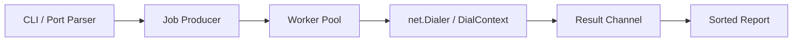

# Go-Fast-Scanner

A compact, concurrent TCP connect scanner written in Go for authorized security testing, lab work, and networking practice.


## Overview

Go-Fast-Scanner v2.0 turns the original single-file proof of concept into a small but production-minded CLI utility. It keeps the implementation intentionally simple while adding configurable targets, flexible port selection, bounded concurrency, cancellation, structured output, IPv4/IPv6-safe addressing, tests, and CI.

The scanner performs standard TCP `connect()`-style checks using Go's `net.Dialer`. It does not use raw packets, SYN stealth techniques, evasion, exploitation, credential attacks, or service fingerprinting.

## Features

- Concurrent worker-pool architecture
- Configurable host, ports, worker count, and timeout
- Port syntax such as `22`, `22,80,443`, `1-1024`, and mixed lists/ranges
- Duplicate removal and strict `1-65535` validation
- Graceful cancellation with `Ctrl+C` / termination signals
- Hostname, IPv4, and IPv6 support via `net.JoinHostPort`
- Numerically sorted results
- Lightweight common-service labels based only on port numbers
- Human-readable and JSON output modes
- Unit tests and localhost-only network tests
- GitHub Actions CI for formatting, vetting, and tests
- Standard-library-only implementation

## Architecture



The worker pool is bounded by the `-workers` option. Each worker consumes ports from a channel and performs a TCP connection attempt with a per-connection timeout. `context.Context` is used to propagate cancellation through the producer and active dials.

## Requirements

- Go 1.22 or newer

## Build

```bash
git clone https://github.com/Michel-DV/Go-Fast-Scanner.git
cd Go-Fast-Scanner
go build -o go-fast-scanner .
```

Windows:

```powershell
go build -o go-fast-scanner.exe .
```

## Usage

```text
Go-Fast-Scanner v2.0.0 - concurrent TCP connect scanner

Usage:
  go-fast-scanner -host <hostname|ip> [options]
```

Examples:

```bash
# Default scan: ports 1-1024
go-fast-scanner -host 127.0.0.1

# Selected ports
go-fast-scanner -host localhost -ports 22,80,443

# Mixed list and range
go-fast-scanner -host 192.168.1.10 -ports 22,80,443,8000-8100

# Custom concurrency and timeout
go-fast-scanner -host scanme.nmap.org -ports 1-1024 -workers 200 -timeout 300ms

# IPv6
go-fast-scanner -host ::1 -ports 1-1024

# JSON output
go-fast-scanner -host 127.0.0.1 -ports 1-1024 -json
```

## CLI flags

| Flag | Default | Description |
| --- | --- | --- |
| `-host` | required | Target hostname or IP address |
| `-ports` | `1-1024` | Port list/range expression |
| `-workers` | `100` | Concurrent worker count, maximum 1024 |
| `-timeout` | `500ms` | Per-connection timeout |
| `-json` | `false` | Emit machine-readable JSON |
| `-version` | `false` | Print version and exit |
| `-h`, `--help` | - | Show usage information |

## Example output

```text
[*] Target:  127.0.0.1
[*] Ports:   20-100 (81 unique)
[*] Workers: 100
[*] Timeout: 500ms

[+] 22/tcp open  ssh
[+] 80/tcp open  http

[*] Completed in 18ms
[*] Ports scanned: 81/81
[*] 2 open port(s) found
```

Service names are informational labels derived from a small local port map. They are not the result of banner grabbing or active fingerprinting.

## JSON mode

`-json` keeps standard output machine-readable so the scanner can be used in scripts or pipelines.

```json
{
  "target": "127.0.0.1",
  "ports_scanned": 1024,
  "workers": 100,
  "timeout_ms": 500,
  "open_ports": [
    {
      "port": 80,
      "service": "http"
    }
  ],
  "duration_ms": 42,
  "interrupted": false
}
```

Errors and interruption notices are written to stderr.

## Port specification

Valid examples:

```text
22
22,80,443
1-1024
22,80,443,8000-8100
```

The parser:

- accepts ports from 1 through 65535
- removes duplicates
- sorts the final port set
- rejects malformed or reversed ranges

## Graceful cancellation

Pressing `Ctrl+C` cancels the scan context. The producer stops scheduling new jobs, in-flight `DialContext` calls are cancelled where possible, workers exit cleanly, and the partial report is returned without a panic or stack trace.

## Testing

Run the full test suite:

```bash
go test ./...
```

Static analysis:

```bash
go vet ./...
```

Formatting check:

```bash
gofmt -w .
```

Network tests use a TCP listener created on `127.0.0.1`; they do not depend on external hosts.

## Design decisions

**TCP connect scanning**  
The project intentionally uses the normal operating-system TCP stack rather than raw packets. This keeps the implementation portable, understandable, and suitable for learning Go concurrency and network programming.

**Bounded workers**  
Concurrency improves throughput on I/O-bound connection attempts, but unbounded goroutine creation is unnecessary. The CLI therefore exposes a configurable worker pool with a hard upper bound.

**Standard library only**  
No third-party runtime dependencies are required. The project uses packages such as `net`, `context`, `flag`, `encoding/json`, `os/signal`, and `sync`.

**No unverified performance claims**  
Actual scan time depends on the target, network latency, firewall behavior, timeout settings, and worker count. The project therefore avoids fixed claims such as "100x faster" without a reproducible benchmark.

## Limitations

- TCP only
- Connect scan only
- No UDP scanning
- No raw SYN scanning
- No OS detection
- No banner grabbing or active service fingerprinting
- No vulnerability detection or exploitation
- Service names are based only on a small static port map

For deeper authorized assessments, use established tools such as Nmap alongside this project.

## Legal and ethical use

Use this software only on systems and networks you own or have explicit authorization to test. Network scanning may violate policy or law when performed without permission.

This repository is intended for cybersecurity education, lab work, tooling development, and authorized security assessment.

## License

Distributed under the MIT License. See [LICENSE](LICENSE).
